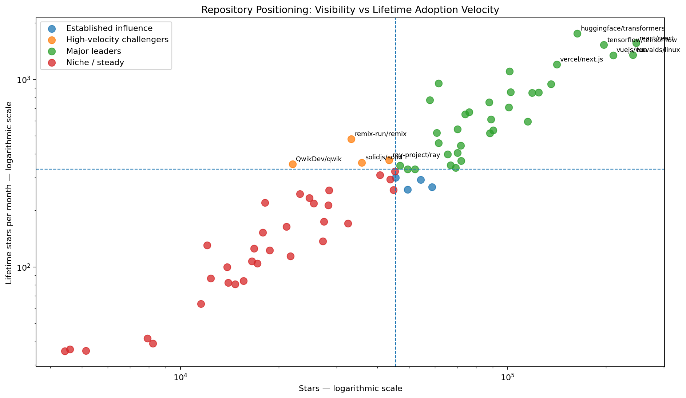

# Open-Source Ecosystem Intelligence

**Adoption, Community Participation, Maintenance Workload, and Repository Health**

This project analyzes a snapshot of 73 prominent GitHub repositories across 14 programming languages to investigate one question:

> **What distinguishes highly visible, fast-adopting, community-oriented, and sustainably maintained open-source projects?**

Rather than treating GitHub stars as a complete measure of success, the analysis separates accumulated visibility from lifetime adoption velocity, fork participation, maintenance workload, and repository activity.



## Key findings

- **Python has the broadest footprint** in the sample and the largest total star count, while language leadership changes when median project performance is considered.
- **Repository attention is moderately concentrated:** the top 10 projects account for **38.6%** of all stars and the corrected Gini coefficient is **0.451**.
- **Visibility and adoption velocity are different signals:** four below-median-star repositories appear as high-velocity challengers — `remix-run/remix`, `ray-project/ray`, `solidjs/solid`, and `QwikDev/qwik`.
- **Stars and forks are strongly related** (`r = 0.832`), but fork intensity surfaces projects with unusually high reuse or technical participation relative to their visibility.
- **Maintenance workload varies materially:** `dotnet/runtime` has the highest open-issue intensity among repositories with at least 10,000 stars.
- **Historical popularity can outlive active development:** inactive or abandoned repositories still account for **238,521 stars**, or about **5.4%** of accumulated star attention in the sample.
- **Age does not explain popularity:** project age has almost no relationship with accumulated stars in this dataset.

## Central conclusion

> **GitHub stars are useful indicators of accumulated visibility, but they are insufficient for measuring current momentum, community health, maintenance sustainability, or software quality.**

## Analysis framework

The notebook examines:

1. Language ecosystem breadth and visibility
2. Concentration of star attention
3. Repository positioning: leaders, challengers, established influence, and niche projects
4. Fork intensity as a community-participation proxy
5. Open-issue intensity and legacy influence
6. Project age and relationships among repository metrics

## Dataset

- **Collection date:** August 4, 2026
- **Repositories:** 73
- **Languages:** 14
- **Total stars:** 4,387,238
- **Total forks:** 1,057,136
- **Open issues:** 138,152

The analysis is based on a selected snapshot rather than a random or complete sample of GitHub, so the findings are descriptive rather than universal rankings.

## Methodological choices

Several fields were deliberately corrected or excluded before interpretation:

- `watchers` was excluded because it duplicated `stars` in the snapshot.
- `project_maturity` was not used because every project was classified as `Mature`.
- `popularity_score` was not treated as an independent signal because it is largely constructed from stars and forks.
- Negative `days_since_commit` values were recalculated using normalized UTC timestamps.
- `stars_per_month` was recalculated and renamed **lifetime star velocity** because it represents a lifetime average, not current growth.
- The Gini coefficient and Lorenz curve use the correct ascending ordering of repository stars.

## Repository structure

```text
open-source-ecosystem-intelligence/
├── README.md
├── open_source_ecosystem_analysis.ipynb
├── requirements.txt
├── .gitignore
├── data/
│   └── processed/
│       └── github_projects_transformed.csv
└── images/
    └── repository_positioning.png
```

## Run locally

```bash
pip install -r requirements.txt
jupyter notebook open_source_ecosystem_analysis.ipynb
```

The notebook automatically looks for `github_projects_transformed.csv` under `data/processed/`.

## Tools

Python, Pandas, NumPy, Matplotlib, Jupyter Notebook

## Limitations and next step

This is a single-date snapshot. The strongest extension would be repeated weekly or monthly collection of stars, forks, commits, pull requests, issue closure rates, contributors, and releases. That would allow true momentum, responsiveness, contributor-health, and maintenance-sustainability analysis.
